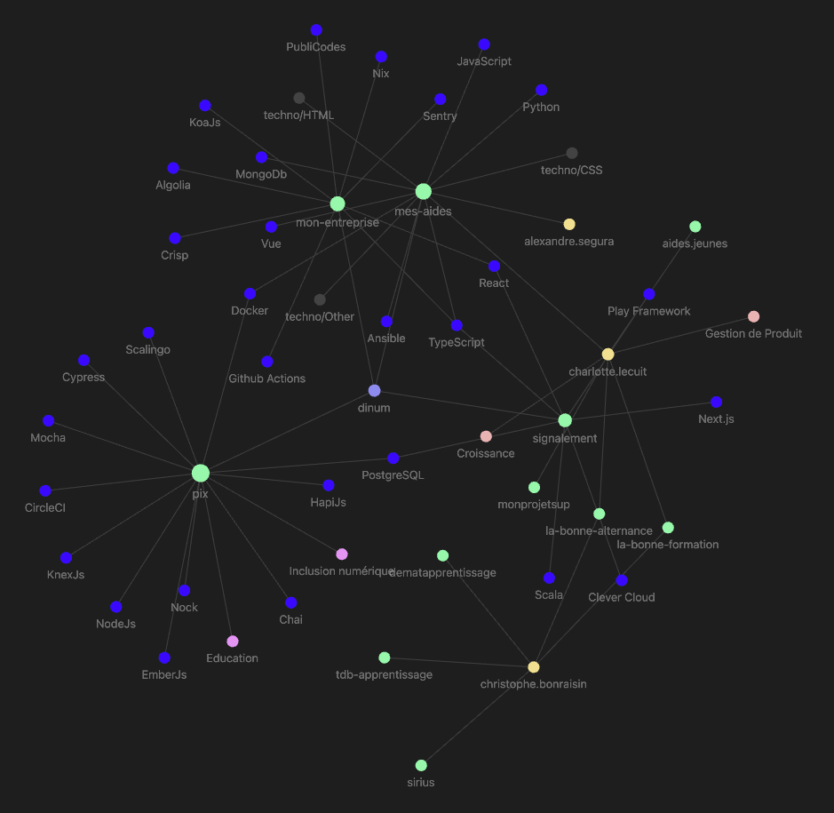

## Sample obsidian vault

Create a vault that could be the result of the generation.

The generation can be based on the `content` folder files

## Obsidian output can use Projects plugin

With almost no change from the original content, we may be able to have a pretty useable tabular visualization of the data.
It is mostly due to the structured frontmatter properties of the content files.

## We can get a lot from authors

After a bit of exploration, I think a good start would be to generate authors notes.

Extracting `startups` and `previously` properties into lists such as :

````md
startups:
- [[startup/monprojetsup]]
````

````md
previously:

- [[startup/la-bonne-formation]]
- [[startup/dematapprentissage]]
- [[startup/la-bonne-alternance]]
- [[startup/sirius]]
- [[startup/tdb-apprentissage]]
````

And for each startup, for now, just create a minimal `startup/file.md` so that the file exists and nodes can have connections.



## 11ty implementation

1. generate startups markdown files
2. generate authors markdown files
   1. list startups
   2. list previously

